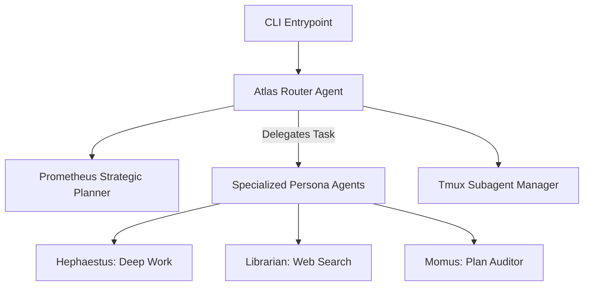
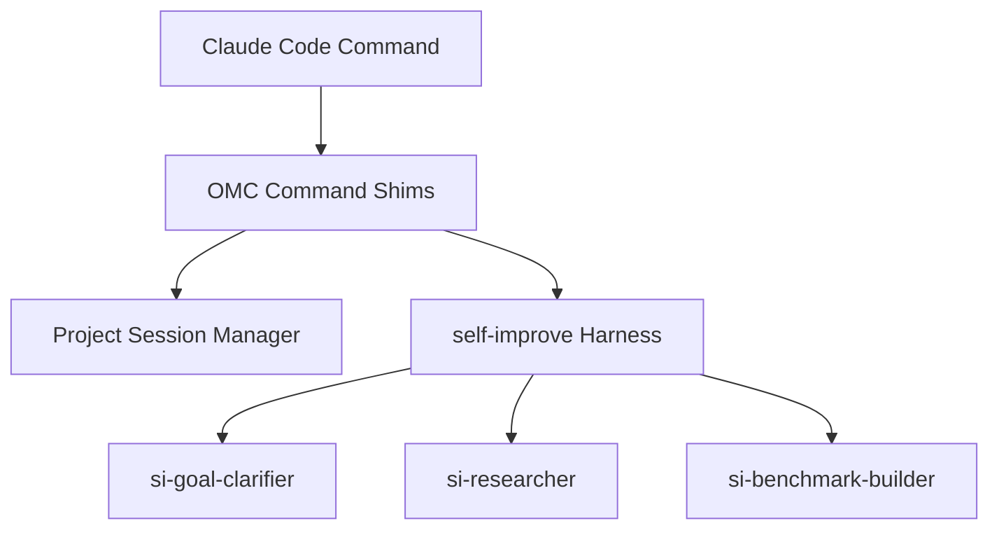
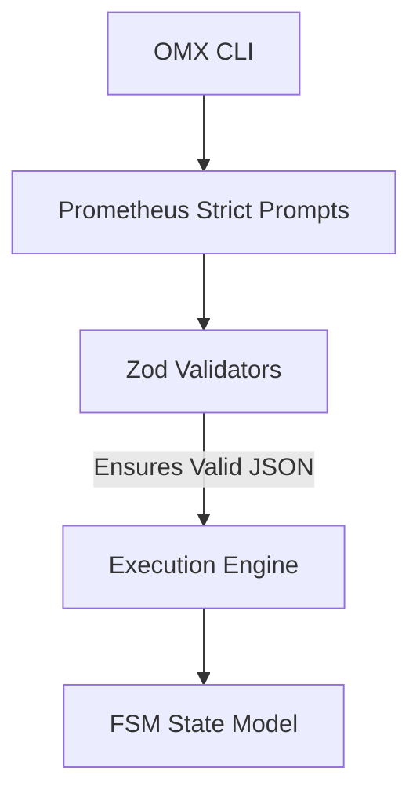
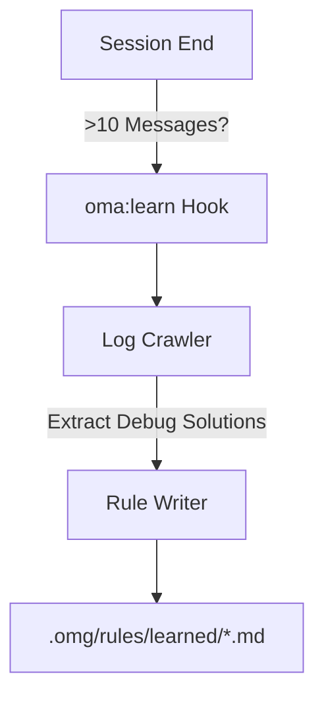

# Deep Dive: The Four "ohmy" Enhancer Architectures

This comprehensive architectural review explores the structural mechanics, runtime behaviors, and prompt design paradigms of the four prominent AI coding tool enhancement frameworks.

---

## Chapter 1: `oh-my-openagent` (OMO) — The Sovereign Orchestrator

### 1.1 Central Philosophy & Architecture
`oh-my-openagent` (OMO) is designed around the concept of a multi-model, multi-agent orchestrator. Rather than relying on a single large language model (LLM) loop to perform all steps, OMO establishes a hierarchical command center. It operates as an autonomous agentic framework overlaying standard CLI tools, enabling deep, parallel, and persistent work streams.

### 1.2 The Hierarchical Routing Engine: Atlas & Prometheus
*   **Atlas (`packages/prompts-core/prompts/atlas/default.md`)**: The general director. Atlas manages task assignment, evaluates outputs from specialized subagents, and determines when a complex goal has been fully met. Atlas prompts are customized per LLM (Gemini, GPT, Opus, Kimi) to handle varying routing styles.
*   **Prometheus (`packages/prompts-core/prompts/prometheus/default.md`)**: The high-level strategist. Prometheus constructs multi-step action plans, prioritizing safety, efficiency, and resource scheduling.

### 1.3 Context Compression & Lifecycle Recovery
Autonomous subagents are prone to token exhaustion (429 rate limits or context bloat). OMO mitigates this via custom hooks:
*   **`anthropic-context-window-limit-recovery`**: Monitors context length. Upon approaching limits, it triggers a recovery state.
*   **`compaction-context-injector`**: Synthesizes the active transaction log into a high-density JSON summary, purges redundant file histories, and restarts the session with a primed, compact context.

### 1.4 Heavyweight Tooling & Parallelism
*   **`tmux-subagent`**: OMO integrates with `tmux` to spin up parallel terminals. The subagent can monitor logs, run build servers, and edit files concurrently without blocking the main chat.
*   **`background-agent`**: Executes long-running tasks asynchronously, alerting the user via notifications only upon completion or error.

---

## Chapter 2: `oh-my-claudecode` (OMC) — The Task Lifecycle Developer OS

### 2.1 Central Philosophy & Architecture
`oh-my-claudecode` (OMC) focuses on augmenting Anthropic's Claude Code command suite. It transforms the developer experience by introducing structured task templates, persistent session managers, and an autonomous prompt optimization harness.

### 2.2 Overriding Commands & Lifecycles
OMC wraps standard agent commands in advanced shims to introduce enhanced lifecycles:
*   **`autoresearch` (`skills/autoresearch/SKILL.md`)**: An automated agent that performs deep web and codebase research without user intervention.
*   **`sciomc` (`commands/sciomc.md` / `skills/sciomc/SKILL.md`)**: Parallelizes scientist research tasks, applying scientific experimentation frameworks to debug code.
*   **`project-session-manager` (PSM)**: Persists workspace state across terminal restarts using structured templates for PR reviews, feature implementations, and hotfixes.

### 2.3 The `self-improve` Prompt Engineering Harness
OMC contains a unique meta-prompt optimization suite:
1.  **`si-goal-clarifier`**: Interactively extracts target performance metrics and defines success thresholds.
2.  **`si-researcher`**: Audits the codebase to locate all relevant modules, test suits, and patterns.
3.  **`si-benchmark-builder`**: Programmatically writes a benchmark script (`harness.md`) that executes the targeted prompt repeatedly, scores the outputs, and refines prompt variables until accuracy goals are achieved.

### 2.4 Safety & Visual Verification Loops
*   **`visual-verdict`**: Connects a headless browser (Playwright/Puppeteer) to capture screenshots of frontend changes. The agent inspects these images to confirm UI design accuracy before making commits.
*   **`verify`**: Intercepts terminal commands to ensure unit tests run in isolated sandboxes, rolling back changes if compilation fails.

---

## Chapter 3: `oh-my-codex` (OMX) — The Math-Constrained Zod Oracle

### 3.1 Central Philosophy & Architecture
Co-maintained by the author of OMC (Yeachan-Heo), `oh-my-codex` (OMX) represents a strict, schema-driven approach to AI coding. Instead of relying on conversational reasoning, OMX forces the LLM to output highly validated data structures, eliminating common agentic looping and tool-calling drift.

### 3.2 The Prometheus Strict Prompt Architecture
OMX introduces "Strict Prompts" which utilize Zod and JSON-Schema parameters to govern model behavior:
*   **`prometheus-strict-oracle`**: An unyielding oracle prompt forcing the model to speak in structured system definitions. It prevents conversational filler and forces exact tool execution.
*   **`prometheus-strict-metis`**: The planner agent. Must output plans conforming to an exact structural schema.
*   **`prometheus-strict-momus`**: The auditor agent. Reviews plans against rigorous edge-case criteria.

### 3.3 State Machine and Anti-Bloat Controls
*   **`STATE_MODEL.md`**: OMX maps its execution state to a strict Finite State Machine (FSM). The agent cannot deviate from designated transitions (e.g., `PLANNING -> REVIEW -> EXECUTION -> VERIFICATION`).
*   **`skills-agents-bloat-audit`**: A specialized tool that detects prompt and subagent duplication. It ensures the codebase does not suffer from prompt-inflation, keeping token consumption optimized.

### 3.4 Shims & Local CLI Tools
*   **`ecomode`**: A token-saving state that swaps high-tier models (e.g., Claude 3.5 Sonnet) with fast, lightweight models (e.g., Gemini Flash, GPT-4o-mini) for mundane tasks like code formatting or file listing.
*   **`doctor`**: A diagnostic check that validates all API keys, local dependencies, and network latencies before initiating sessions.

---

## Chapter 4: `oh-my-antigravity` (OmA) — The Self-Evolving Consensus Engine

### 4.1 Central Philosophy & Architecture
`oh-my-antigravity` (OmA) is a self-reflective, consensus-driven CLI extension framework. OmA's standout feature is its ability to learn dynamically from session history. Instead of relying on static system instructions, it actively updates its local rule system after detecting successful debug runs.

### 4.2 The `/oma:learn` SessionEnd Hook
The heart of OmA's self-evolution is the `/oma:learn` skill:
*   **Trigger**: Fires automatically at `SessionEnd` if the transaction contains more than 10 messages.
*   **Crawl**: The tool crawls the system log files, parsing user issues, tool execution errors, and the successful resolution scripts.
*   **Synthesis**: It synthesizes the exact workaround (e.g., a specific compilation flag, a mock interface structure, or an API quirk).
*   **Persistence**: It writes a new, structured rule file to `.omg/rules/learned/`.
*   **Activation**: In subsequent sessions, the `rules-injector` loads these learned files, ensuring the agent never makes the same mistake twice.

### 4.3 The Consensus-Director Parallel Planning Loop
For high-stakes changes, OmA bypasses singular decision makers:
*   **Specialized Personas**: Architect, Researcher, Reviewer, and Editor propose alternative solutions.
*   **Consensus Agent**: Merges the proposals, resolves conflicts, and produces a single unified plan.
*   **Director Agent**: Acts as the gatekeeper, validating the consensus plan against project security and architectural constraints before granting tool execution permissions.

---

## Chapter 5: Architectural Synthesis & The Future of Agentic OS

Analyzing these four distinct projects reveals a clear evolution in the "Agentic OS" paradigm:

1.  **Orchestration Styles**:
    *   *Conversational Hierarchy* (OMO): Relies on strong LLM routing logic (Atlas) but is prone to command drift.
    *   *Structured Lifecycle* (OMC): Focuses on automating standard software engineering milestones (benchmarks, PR reviews).
    *   *Schema Constrained* (OMX): Sacrifices conversational flexibility for absolute structural correctness (Zod schemas).
    *   *Self-Reflective Consensus* (OmA): Uses multi-persona voting for safety and automatically compiles lessons learned to local disk storage.

2.  **Prompt Engineering Paradigms**:
    *   Traditional agents rely on monolithic, static prompts.
    *   Modern enhancers (like OMX and OmA) treat prompts as **dynamic software modules** that are compiled, validated, and optimized at runtime.

3.  **Local Learning vs. RAG**:
    *   Instead of standard Vector-DB RAG which retrieves fuzzy matches, OmA's approach of writing exact, code-targeted rules (`learned/*.md`) to local disk offers a deterministic and token-efficient method for continuous agent improvement.
